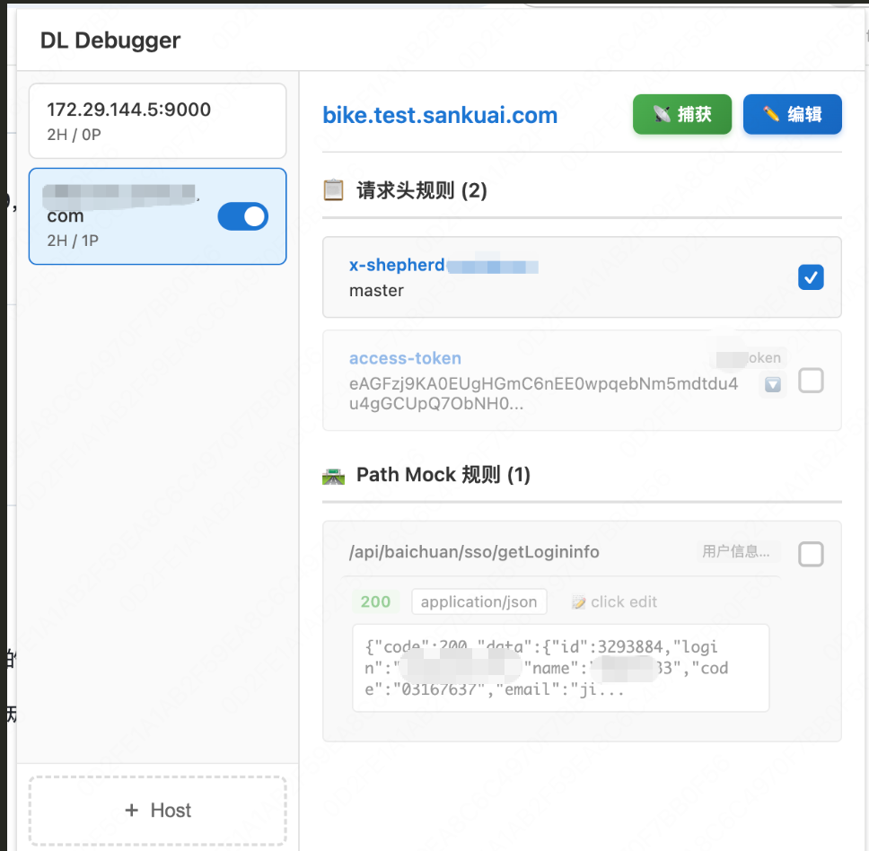
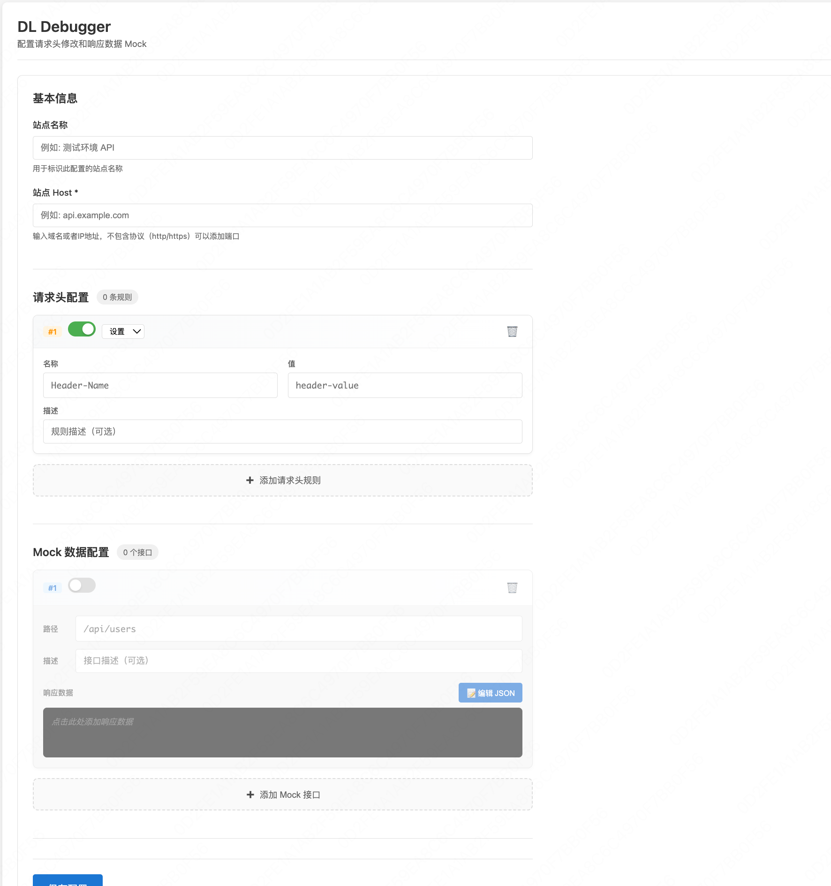
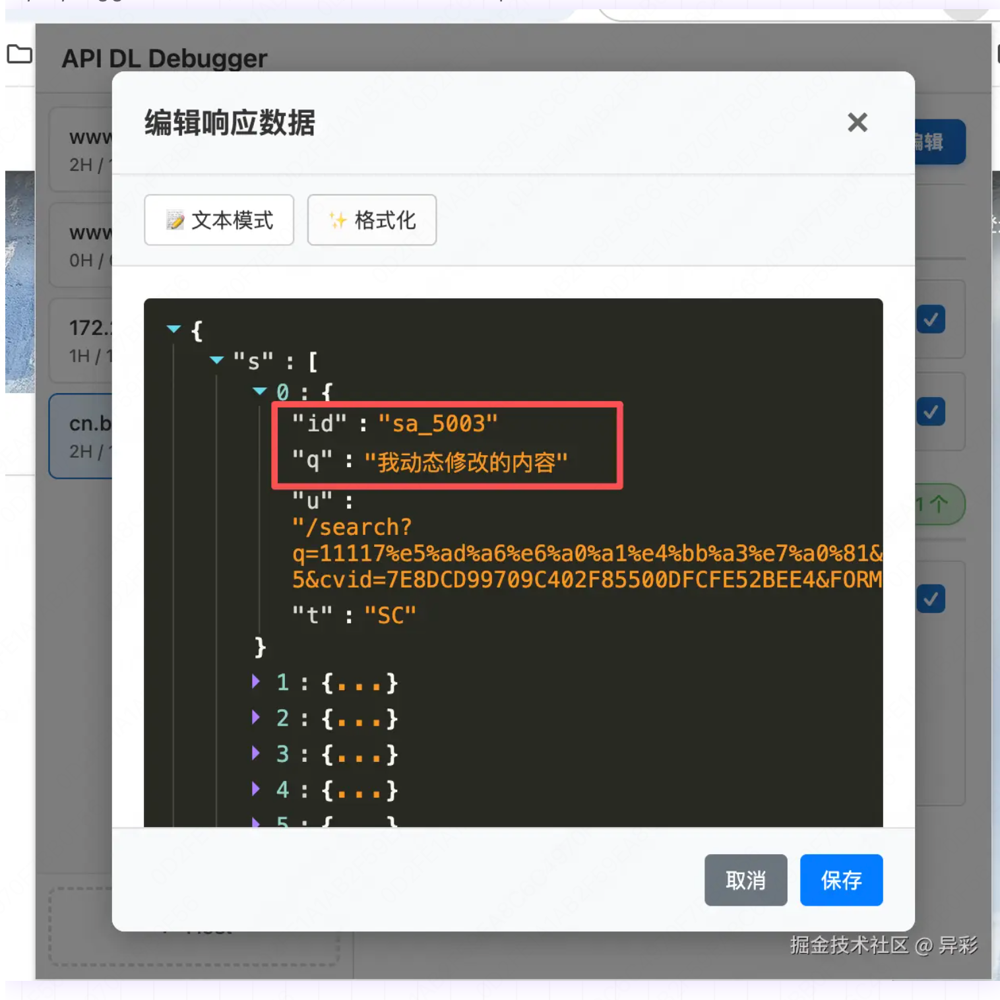
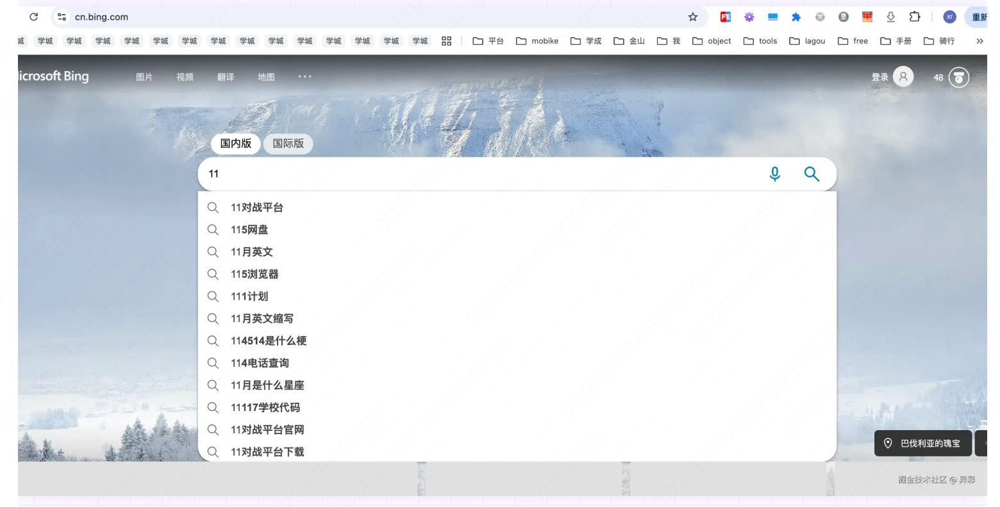
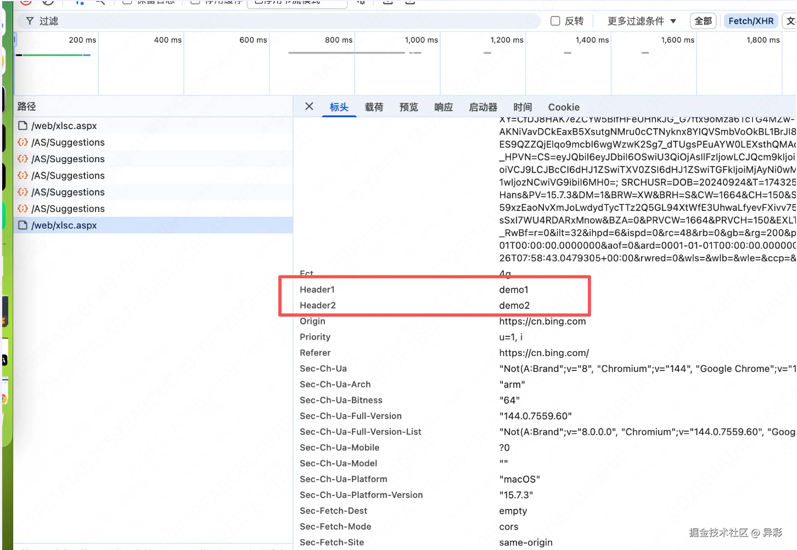
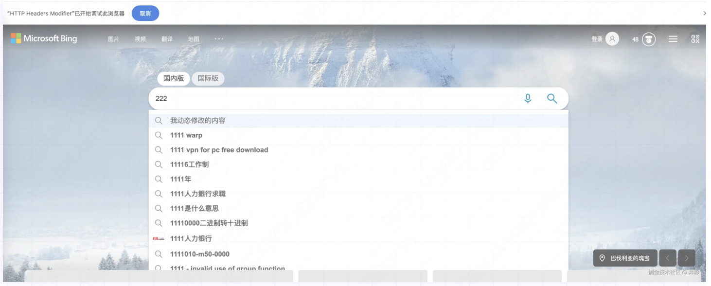
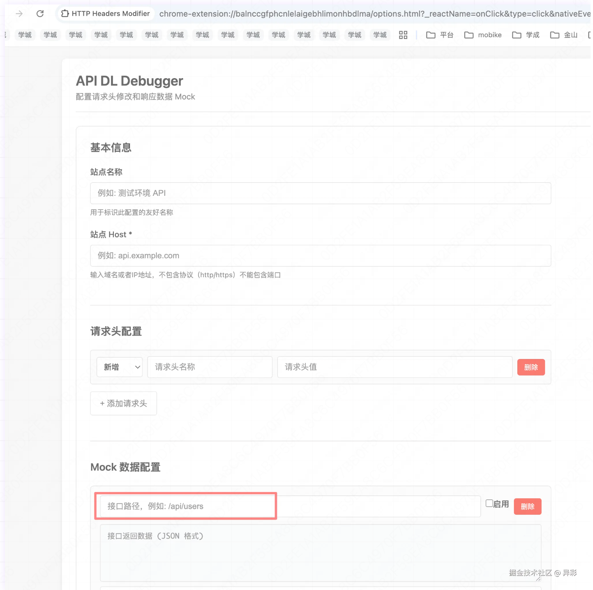
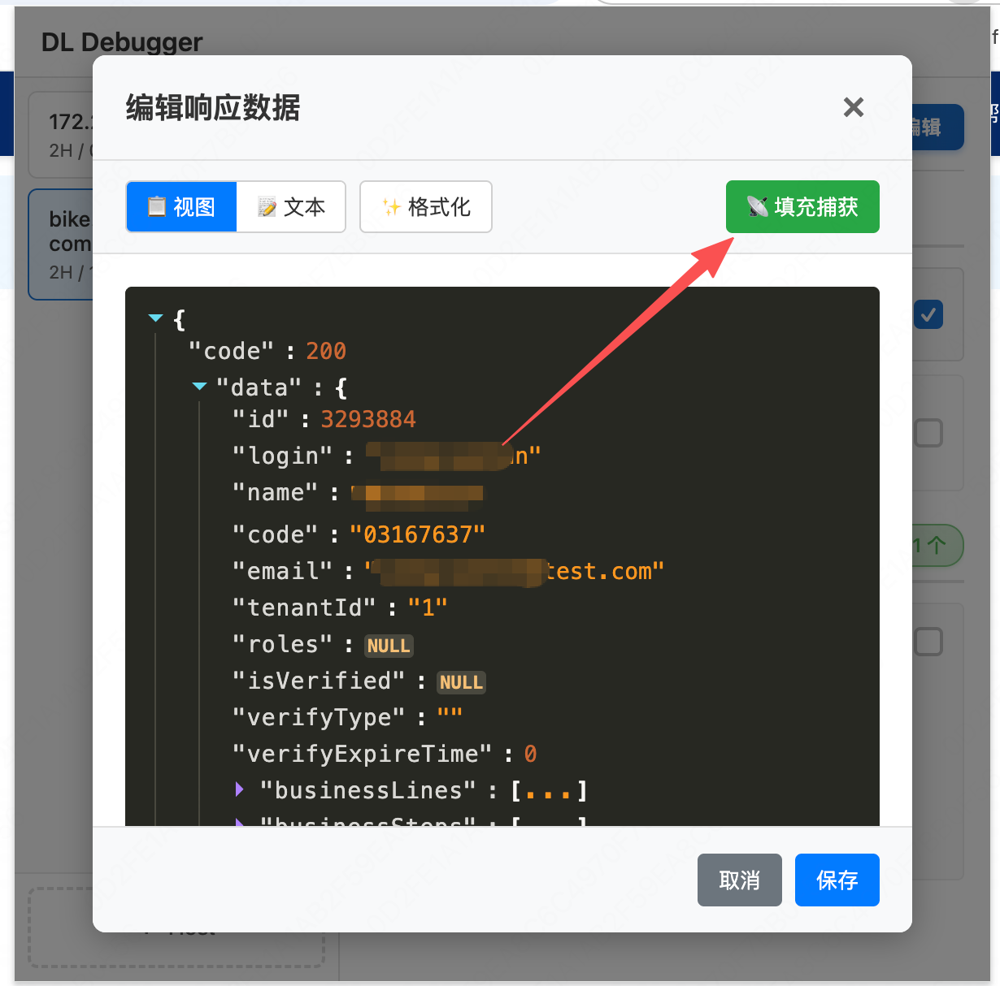

## 广告开始

hello bro!!!

你在web开发过程中是否有这样的困扰。

*   生产环境验证数据交互，无法独自修改返回数据。
*   开发环境要调整头信息，切换表示。
*   指定某一个接口返回mock数据。

如果你也有以上问题，那今天给大家安利一个chrome插件，不要999， 不要99，只要0.000009，就当**交个朋友**。

## 正文正能量

所谓一图胜千言，先贴图

## 新增站点配置

插件主页面左侧边栏是菜单站点选项

最下面新增站点，点击跳转新页面新增，站点名称和站点host是必填的，编辑完成后添加保存按钮。

以下以cn.bing.com站点配置说明，请求头新增了header1和header2两个头信息，mock部分代理了/as/suggesions的接口返回并修改了返回内容q

保存配置成功后，在**未开启**调试状态下：

**开始**调试后
image.png
*   请求头也会新增我添加的两个头信息
    

*   代理接口规则也生效 无论我输入什么返回的都是配置的内容。
    

## 总结功能特性

*   ✅ 动态添加、编辑和删除请求头规则
*   ✅ 支持 URL 模式匹配（支持通配符）
*   ✅ 实时代理接口返回数据，方便生产和开发环境的调试

## 这里解释一下**捕获**

**用法**：

1.  当新增或编辑站点时候，并配置好接口路径并保存，切换到站点页面点击捕获按钮，刷新或者重新触发你配置的path的请求，插件会记录接口返回内容作为api mock的原始数据，你可以在此基础上编辑。
    

2.  按path捕获数据成功后会显示这个按钮，点击会把捕获的内容填充到文本框可进一步编辑。
    

你也可以直接手动补全接口返回。

## 总结

以上就是最近折腾的一个小工具，因为我的使用场景有限，就先发个问题让大家看看给点意见，后续真的有用了，在push到谷歌的插件商店里。欢迎大家使用给出建议和反馈。
